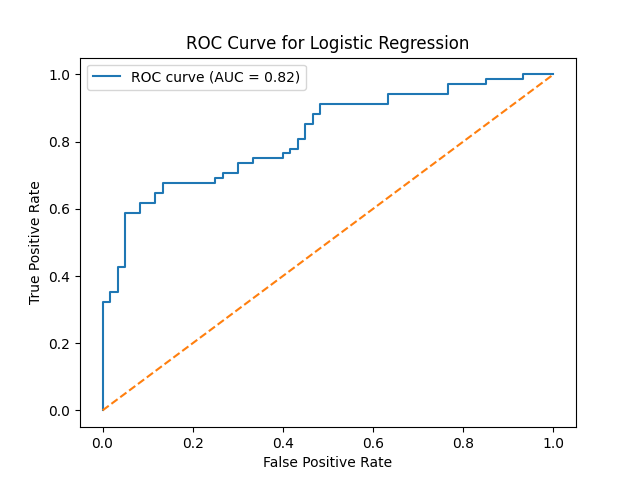
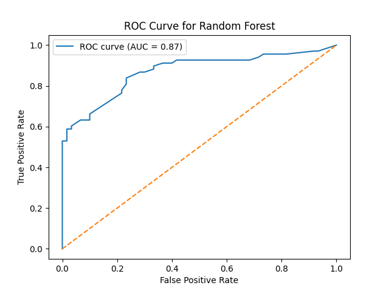

# COVID-19-Antiviral-Prediction
Machine learning-based drug screening to predict binding affinity for antiviral compounds against SARS-CoV-2, as part of the 2022 Lawrence Livermore National Laboratory Data Science Challenge.

## Objective
The objective of this project is to develop a machine learning model that predicts whether a given compound will or will not bind with a target protein on the SARS-CoV-2 virus. Binding to this protein can inhibit the virus's ability to replicate and infect host cells, a critical aspect in the development of antiviral agents against COVID-19. This binary classification task plays a vital role in the field of drug discovery, particularly in the identification of potential antiviral agents against diseases such as COVID-19. Utilizing a dataset that encompasses various molecular descriptors for each compound, the challenge provides an opportunity to apply machine learning techniques to solve a real-world problem with significant implications for public health.

## Methodology
Data Preprocessing: The data is loaded and preprocessed to handle missing values, infinite values, and feature scaling.
Model Training: Logistic Regression and Random Forest models are trained on the preprocessed data.
Model Evaluation: The models are evaluated on the test compound set, and the results are reported, including accuracy, precision, recall, F1 score, and AUC-ROC curve.

## Data
The dataset is stored in a CSV file, mpro_exp_data2_rdkit_feat.csv. Each row represents a compound, and the columns include:
cmpd_id: Compound ID
smiles: SMILES string
label: bind or no-bind
subset: train, valid, or test
feat1 to feat208: Molecular descriptors (Note that some features may contain NaN values)

## Results
### Logistic Regression: 
__Accuracy:__ 75.00% 
__Precision:__ 82.14% 
__Recall:__ 67.65% 
__F1 Score:__ 74.19% 
__AUC:__ 81.79% 

### Random Forest: 
__Accuracy:__ 77.34% 
__Precision:__ 97.56% 
__Recall:__ 58.82% 
__F1 Score:__ 73.39% 
__AUC:__ 87.07% 

## Conclusion
In the course of this project, two machine learning models were trained and evaluated for their ability to predict the binding affinity of antiviral compounds against SARS-CoV-2: Logistic Regression and Random Forest. A comparison of the results reveals that:
* The Random Forest model achieved a higher accuracy of 77.34%, compared to 75.00% for Logistic Regression.
* Precision was remarkably higher in the Random Forest model at 97.56%, indicating a higher rate of true positive predictions.
* While Logistic Regression exhibited a higher recall, the Random Forest model demonstrated a superior AUC (Area Under the Curve) of 87.07%, suggesting a better overall ability to distinguish between binding and non-binding compounds.
* Based on these findings, the Random Forest model is identified as the more effective approach for this specific task.

## Running the Project
__Install Dependencies:__ Run pip install pandas numpy matplotlib scikit-learn. 
__Execute the Script:__ Run python main.py. 
__View Results:__ Check the terminal for evaluation metrics for Logistic Regression and Random Forest models. The ROC curves will be displayed in separate windows.

## License

This project is open-source and available under the MIT License. See the `LICENSE` file for more details.

